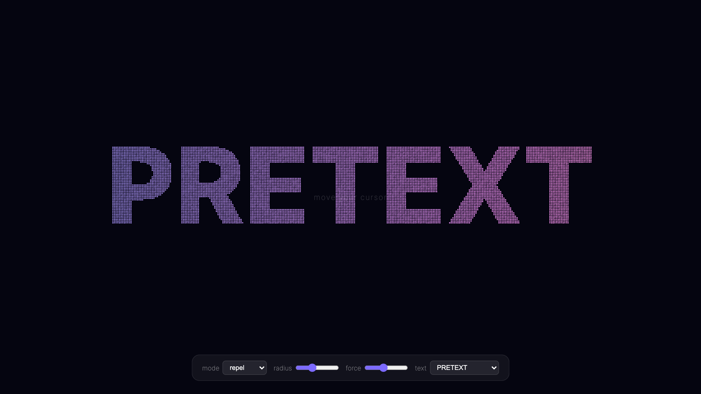
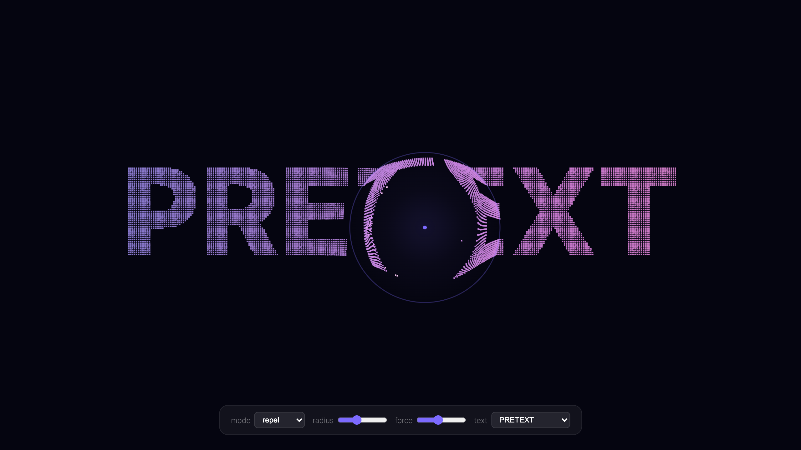
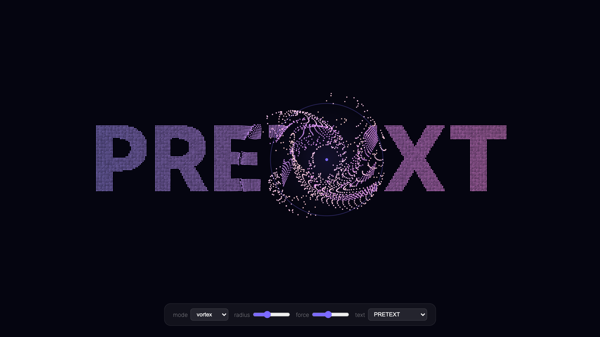
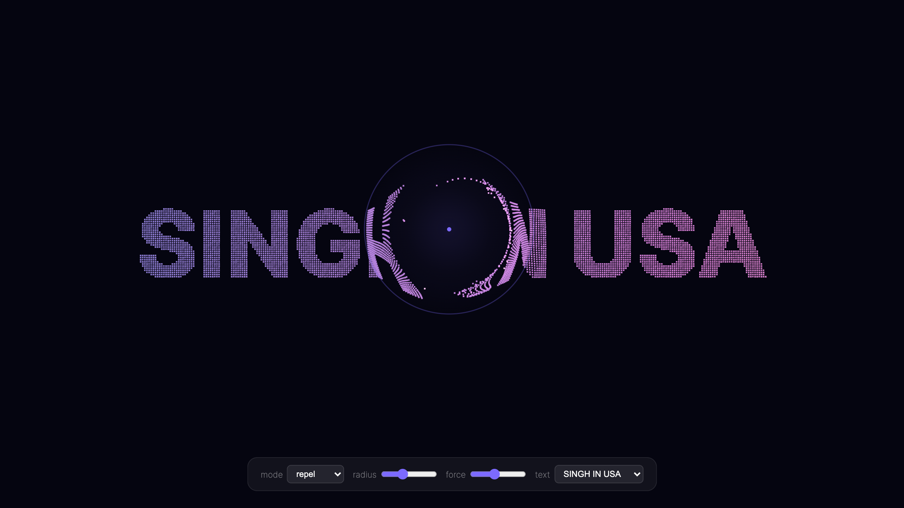

# Pretext Interactive Demos

Interactive demos showcasing [@chenglou/pretext](https://github.com/chenglou/pretext) — DOM-free text measurement & layout.

## Cursor Penetration Demo

Your cursor becomes a force field that blasts through particle text. Every character is a physics particle that scatters on contact and drifts back into place.


### Modes

| Mode | Effect |
|------|--------|
| **Repel** | Particles blast away from cursor |
| **Vortex** | Particles swirl around cursor |
| **Explode** | Chaotic burst with random scatter |
| **Magnet** | Particles get pulled toward cursor |

<p align="center">
  
  
</p>
<p align="center">
  
  
</p>

### Controls

- **Mode** — switch between repel, vortex, explode, magnet
- **Radius** — cursor influence area
- **Force** — how hard particles get pushed
- **Text** — PRETEXT, HELLO WORLD, PENETRATE, HARNOOR, DISRUPTION, SINGH IN USA
- **Hold mouse** — 2.5x force multiplier

### Singh in USA


## Pretext API Demo

An interactive showcase of pretext's core features:

1. **Instant Text Measurement** — `prepare()` + `layout()` with live width/height sliders
2. **Manual Line Layout** — `layoutWithLines()` rendering on canvas with per-line width visualization
3. **Variable-Width Wrapping** — `layoutNextLine()` wrapping text around obstacles
4. **Inline Flow** — Mixed fonts and atomic chip elements
5. **Performance Benchmark** — DOM reflow vs pretext, measuring 500 text blocks

## Run Locally

```bash
# Just open the HTML files — no build step needed
open cursor-demo.html
open index.html
```

## Regenerate Screenshots

```bash
npm install
node capture.mjs        # PRETEXT screenshots + GIF
node capture-singh.mjs  # SINGH IN USA screenshots + GIF
```

## License

[MIT](LICENSE)
